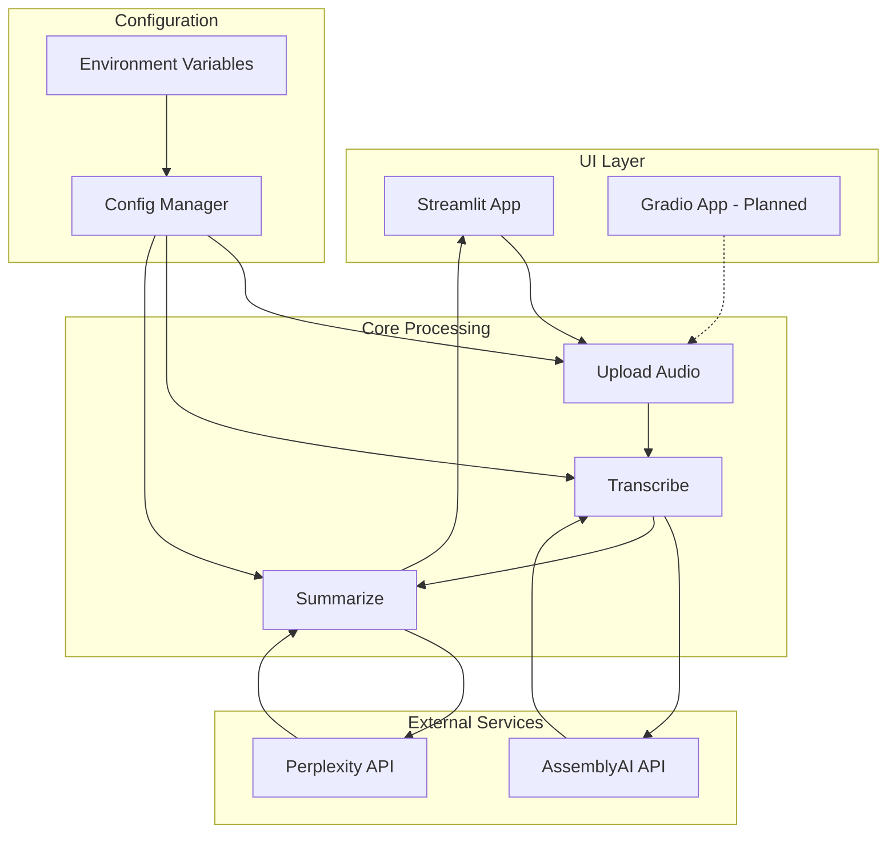
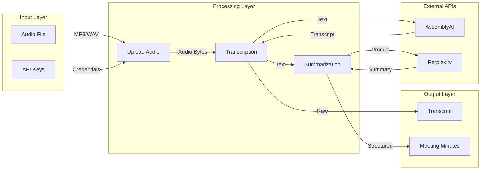
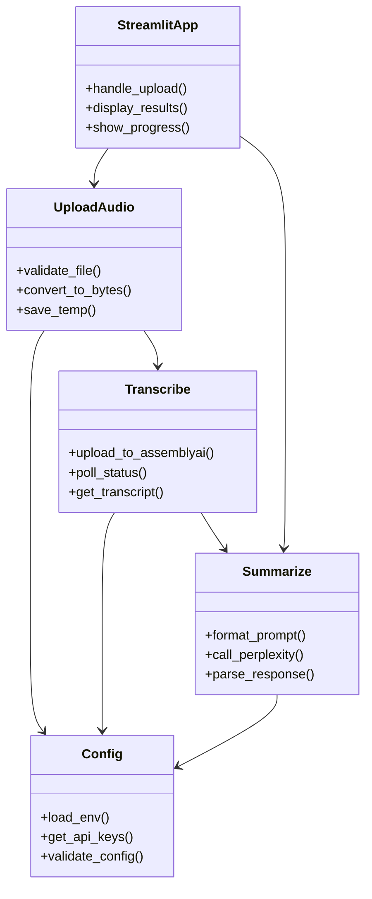
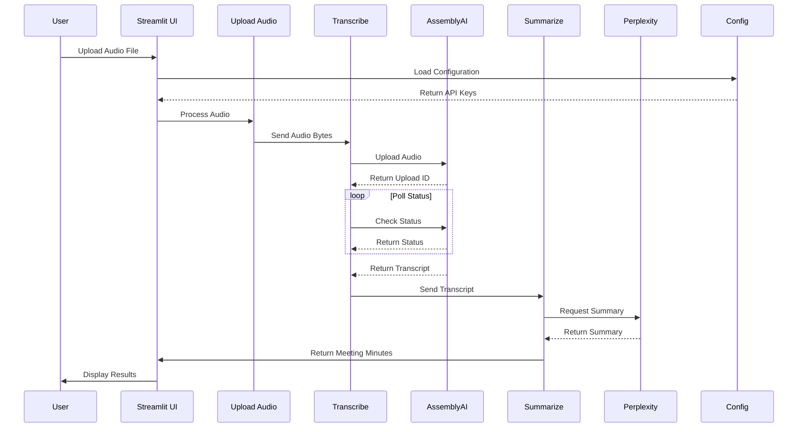
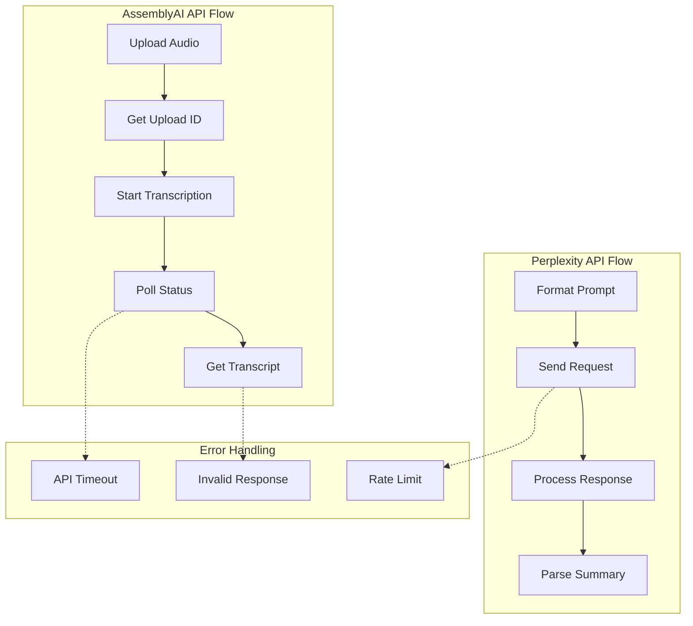
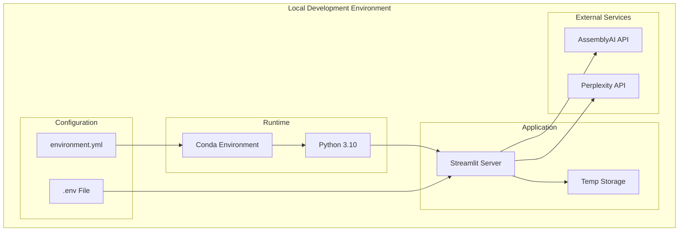

# Audio to Meeting Minutes Converter

Convert audio recordings of meetings into structured meeting minutes using AI.

## Features

- Upload audio files (MP3, WAV)
- Automatic transcription using AssemblyAI
- AI-powered meeting minutes generation using Perplexity API
- Structured output with key points, action items, and decisions

## Setup

1. Clone the repository:
```bash
git clone <your-repo-url>
cd week3-audio-to-meeting-minutes-converter
```

2. Create and activate conda environment:
```bash
conda env create -f environment.yml
conda activate v2tmt
```

3. Create `.env` file with your API keys:
```
ASSEMBLYAI_API_KEY=your_assemblyai_api_key
PERPLEXITY_API_KEY=your_perplexity_api_key
```

## Usage

1. Start the Streamlit app:
```bash
streamlit run ui/streamlit_app.py
```

2. Open your browser at http://localhost:8501

3. Upload an audio file and wait for processing

## Project Structure

```
week3-audio-to-meeting-minutes-converter/
├── ui/
│   ├── streamlit_app.py    # Streamlit UI implementation
│   └── gradio.py          # Gradio UI implementation (planned)
├── tasks/
│   ├── upload_audio.py    # Audio file handling
│   ├── transcribe.py      # AssemblyAI transcription
│   └── summarize.py       # Perplexity API summarization
├── config.py              # Configuration and settings
└── environment.yml        # Conda environment
```

## Requirements

- Python 3.10
- AssemblyAI API key
- Perplexity API key
- See environment.yml for full dependencies

---

# Technical Architecture Canvas

**Product:** Audio-to-Meeting Minutes Converter
**Date:** 2024-03-19
**Version:** 1.0

---

## 1. Business Drivers & Constraints

### Business Drivers

* **Productivity Boost:** Automate manual meeting note-taking.
* **Time Savings:** Reduce 60+ mins of work to a 5-minute automated flow.
* **Consistency:** Standardized meeting minutes across the organization.
* **Remote Work Support:** Essential for distributed or virtual teams.
* **Actionable Outputs:** Extract clear action items and decisions.

### Key Constraints

* **API Dependency:** Heavy reliance on AssemblyAI & Perplexity AI.
* **Usage Cost:** Pay-per-use model for third-party AI services.
* **Requires Internet:** No offline processing.
* **Audio Quality:** Transcription accuracy depends on recording quality.
* **Single User:** Streamlit limits to one concurrent session.

---

## 2. Architecture Overview

### System Type

**Event-Driven Pipeline Architecture** using a **Microservices Pattern**.

### Architecture Style

* **Pipeline:** Audio → Transcript → Minutes (sequential flow)
* **Service-Oriented:** Modular, task-based components.
* **API-First:** Core logic is integration with external APIs.
* **Stateless:** No persistent storage of user data.

### Key Architectural Decisions

1. **External APIs:** Use best-in-class AI services over in-house models.
2. **UI Framework:** Streamlit for rapid prototyping with Gradio planned for future.
3. **Env-Based Config:** Credentials managed via environment variables.
4. **Task Modularization:** Separate components for maintainability.

---

## 3. Functional Components

### Core Services

```
┌───────────────┐   ┌───────────────┐   ┌───────────────┐
│  UI Layer     │   │ Application   │   │ Processing    │
│  (Streamlit)  │   │ Orchestrator  │   │ Pipeline      │
├───────────────┤   ├───────────────┤   ├───────────────┤
│ File Upload   │   │ Config Mgmt   │   │ Audio Handler │
│ UI/Progress   │   │ Error Handler │   │ Transcription │
│               │   │               │   │ Summarization │
└───────────────┘   └───────────────┘   └───────────────┘
```

### Component Table

| Component         | Technology           | Responsibility                | Interface       |
| ----------------- | -------------------- | ----------------------------- | --------------- |
| `ui/streamlit_app.py` | Streamlit        | UI, user interaction          | Web UI          |
| `tasks/upload_audio.py` | Python         | File upload, byte conversion  | Internal API    |
| `tasks/transcribe.py` | AssemblyAI SDK     | Speech-to-text                | REST API        |
| `tasks/summarize.py` | Requests, Perplexity | Meeting minutes summarization | REST API        |
| `config.py`       | Pydantic             | Config management             | Environment Var |

---

## 4. Infrastructure & Deployment

### Current Infrastructure

```
┌──────────────────────────────────────────┐
│ LOCAL DEVELOPMENT                        │
├──────────────────────────────────────────┤
│ Runtime: Python 3.10 + Conda             │
│ Streamlit server (port 8501)             │
│ Local temp storage: /tmp/                │
│ AssemblyAI API, Perplexity API           │
└──────────────────────────────────────────┘
```

### Deployment

* **Environment:** Local/single machine
* **Runtime:** Python + Conda
* **Config:** .env file
* **Process:** Run directly via Streamlit
* **Monitoring:** Manual application logging

### Technology Stack

| Layer       | Technology | Version | Purpose         |
| ----------- | ---------- | ------- | --------------- |
| Frontend    | Streamlit  | Latest  | Web UI          |
| Backend     | Python     | 3.10    | App runtime     |
| HTTP Client | Requests   | Latest  | API calls       |
| Config      | Pydantic   | Latest  | Settings        |
| Environment | Conda      | Latest  | Dependency Mgmt |

---

## 5. Integration Architecture

### API Integration

* **AssemblyAI API:** Upload (audio), Transcribe (async, poll status)
* **Perplexity AI API:** Summarize (sync)

### Data Flow

1. **Audio Upload** → Local (bytes) → AssemblyAI → Transcript
2. **Transcript** → Perplexity AI → Meeting Minutes
3. **Output** → Streamlit UI → User

---

## 6. Security Architecture

### Security Layers

* **Credential Management:** API keys via environment variables (never hardcoded).
* **Data Protection:** No persistent storage; temp files only, in-memory processing.
* **Transport Security:** All external API calls via HTTPS.
* **Input Validation:** Accept only valid audio (mp3/wav); handle input errors.

### Security Controls

* **Authentication:** API Key (external services)
* **Authorization:** Environment-based access
* **Data Privacy:** Memory-only processing, no long-term data retention
* **Audit Trail:** Application logs for debugging

---

## 7. Scalability & Performance

### Current Performance Profile

| Metric           | State         | Bottleneck   |
| ---------------- | ------------- | ------------ |
| Concurrent Users | 1             | Streamlit UI |
| Processing Time  | ~2x audio     | API Latency  |
| Memory Usage     | Low           | File size    |
| Network          | API Dependent | Internet     |

### Scalability Constraints & Opportunities

* **Current Limits:** Single-user, API quotas, sequential (non-parallel) processing.
* **Opportunities:** 
  - Gradio implementation for better UI/UX
  - Horizontal scaling (multi-instance)
  - Queue-based processing
  - Caching transcripts/results

---

## 8. Monitoring & Observability

### Current State

* **Logs:** `tasks/upload_audio.py`, `tasks/transcribe.py`, `tasks/summarize.py`, exception logging.
* **Review:** Manual log review, no metrics or APM.

**Missing:**

* Metrics, user analytics, API latency tracking, resource monitoring.

---

## 9. Technical Debt & Risks

### Technical Debt Table

| Area           | Debt                     | Impact      | Priority |
| -------------- | ------------------------ | ----------- | -------- |
| UI Framework   | Streamlit single-user    | Scalability | Medium   |
| Error Handling | Basic exception handling | Poor UX     | High     |
| Testing        | No automated tests       | Maintenance | High     |
| Docs           | Limited inline docs      | Onboarding  | Medium   |

### Architecture Risks

* **High:** External API dependency, no failover, single-user only.
* **Medium:** Local credential storage, no result caching, limited observability.
* **Low:** Stable tech stack, clean codebase.

---

## 10. Evolution Roadmap

### Immediate (1–3 months)

* Add unit/integration tests
* Improve error handling & user messages
* Expand documentation
* Secure credential management

### Short-term (3–6 months)

* Implement Gradio UI alternative
* Caching results for repeated processing
* Add metrics & monitoring (APM)
* Implement CI/CD

### Long-term (6–12 months)

* Microservices architecture
* Queue system for async processing
* Add database for persistent user/accounts
* Public API Gateway

---

## Architecture Assessment

### Strengths

* Rapid prototyping, modular design
* Leverage powerful external AI
* Simple setup & configuration
* Multiple UI framework options (Streamlit + planned Gradio)

### Weaknesses

* No multi-user, external service dependency, minimal observability, lack of automated tests

### Recommendation

* **Current:** Excellent for MVP/prototyping
* **Next:** Add multi-user, monitoring, and testing for production-readiness

## Architecture Diagrams

### 1. High-Level Architecture Diagram


### 2. Data Flow Diagram


### 3. Component Diagram


### 4. Sequence Diagram


### 5. API Flow Diagram


### 6. Deployment Diagram



